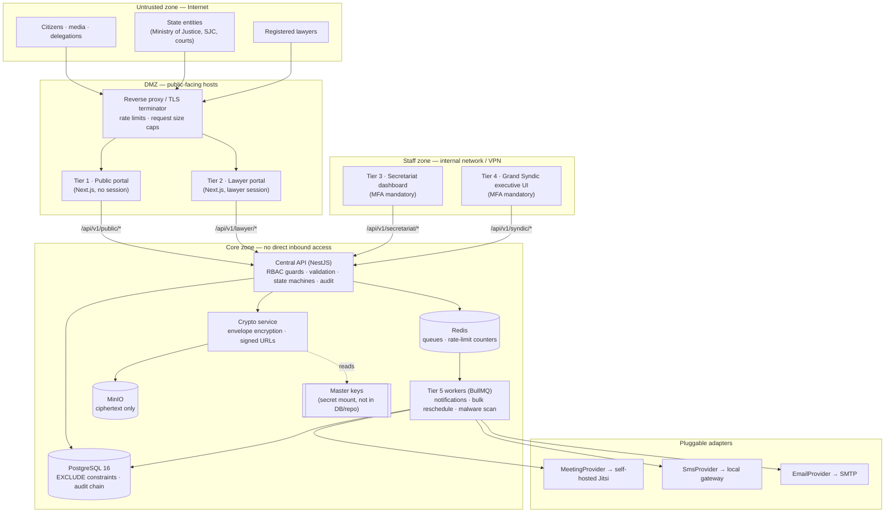
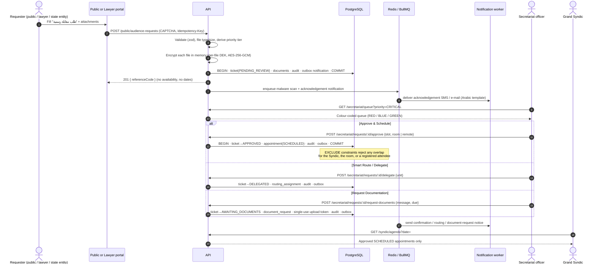
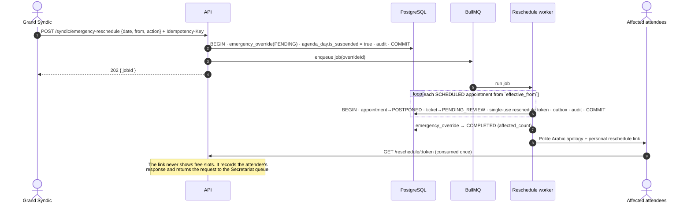

# Architecture

This document describes how the five tiers of the system communicate, where the
trust boundaries are, and how a request travels from intake to the Grand Syndic's
agenda. Database details are in [`DATABASE.md`](DATABASE.md).

## 1. Design principles

| Principle                         | Consequence in the design                                                                                                                                                                                               |
| --------------------------------- | ----------------------------------------------------------------------------------------------------------------------------------------------------------------------------------------------------------------------- |
| **Human control over the agenda** | Nothing is ever auto-confirmed. Every request enters `PENDING_REVIEW`; a Secretariat officer is the only actor who can place an item on the Grand Syndic's agenda. A database trigger rejects any other starting state. |
| **Defence in depth**              | Each rule is enforced at least twice: in the service layer (clear errors, business context) and in PostgreSQL (constraints, triggers, privileges) so a bug or a compromised API process cannot bypass it.               |
| **Auditability**                  | Every state change writes an append-only, hash-chained audit entry inside the same transaction as the change. If the audit write fails, the change rolls back.                                                          |
| **Sovereignty**                   | Every dependency is self-hostable: PostgreSQL, Redis, MinIO, Jitsi, SMTP, a local SMS gateway. Foreign SaaS (Zoom, Teams, Twilio, AWS, Google) is optional behind adapters, never required.                             |
| **Least exposure**                | The public tier learns nothing about availability. Staff tiers are separate surfaces with mandatory MFA. Documents are only ever served decrypted through short-lived, session-bound URLs.                              |

## 2. Tiers and how they communicate



**Tier 5 (Central Booking & Cryptography Engine)** is not a separate network
service in the first iteration: it is a set of NestJS modules (booking, crypto,
notifications) inside the API process plus BullMQ worker processes built from the
same codebase. This keeps transactions local (an approval, its appointment, its
audit entry and its outbox notification commit atomically) while still letting
workers scale and fail independently. It can be split out later without changing
the API contract.

### API surface by tier

| Tier          | Route prefix                                    | Caller identity                                                          | Notes                                                                      |
| ------------- | ----------------------------------------------- | ------------------------------------------------------------------------ | -------------------------------------------------------------------------- |
| 1 Public      | `/api/v1/public/*`, `/api/v1/reschedule/:token` | Anonymous (CAPTCHA + rate limit) or single-use token                     | Write-mostly. Returns a reference code, never availability.                |
| 2 Lawyer      | `/api/v1/lawyer/*`                              | Lawyer session (registration no. + national ID + password, optional OTP) | Sees only own tickets and appointments.                                    |
| 3 Secretariat | `/api/v1/secretariat/*`                         | Secretariat session, MFA verified                                        | Only tier that can approve, delegate or request documents.                 |
| 4 Syndic      | `/api/v1/syndic/*`                              | Grand Syndic session, MFA verified                                       | Read-only agenda + emergency reschedule.                                   |
| — Documents   | `/api/v1/documents/:id/view-url`                | Any staff/lawyer session with access to the parent ticket                | Issues a ≤ 5-minute, session-bound URL; every issue and access is audited. |

## 3. Trust boundaries

| #   | Boundary                     | What crosses it              | Controls                                                                                                                                                                             |
| --- | ---------------------------- | ---------------------------- | ------------------------------------------------------------------------------------------------------------------------------------------------------------------------------------ |
| B1  | Internet → DMZ               | HTTPS requests, uploads      | TLS 1.2+, HSTS, request size caps, per-IP rate limits at the proxy, self-hosted CAPTCHA on public forms                                                                              |
| B2  | Browser → API                | JSON over HTTPS              | Strict CORS allowlist (no wildcards), CSRF token on cookie-authenticated mutations, `Idempotency-Key` on mutations, zod validation on every DTO                                      |
| B3  | Staff zone → API             | Privileged actions           | Mandatory TOTP MFA, short-lived access tokens (10 min), rotating refresh tokens with replay detection, staff UIs not reachable from the Internet (recommended — see Q-A1)            |
| B4  | API → PostgreSQL             | SQL                          | Parameterised queries only (Prisma / tagged templates), runtime role `sba_app` with DML only, no `DELETE` on legal records, no write access to audit history or state-machine tables |
| B5  | API → MinIO                  | Ciphertext blobs             | Least-privilege service account (Get/Put on one bucket), bucket has no anonymous policy, versioning on                                                                               |
| B6  | API → key material           | Master keys (KEKs)           | Read from a secret file at start-up; never logged, never persisted, never sent to workers that do not need them                                                                      |
| B7  | Workers → external providers | SMS / e-mail / meeting links | Provider adapters; outbound allowlist; payloads contain only what the recipient must see                                                                                             |

## 4. Request lifecycle: intake → triage → agenda



### Emergency reschedule (إعادة جدولة طارئة)



Each appointment is postponed in its own small transaction, so one failure does
not roll back the others, and the job is safely re-runnable (already-postponed
appointments are skipped; outbox `dedupe_key` prevents duplicate messages).

### Documents

1. **Upload:** the request body is streamed into memory (size-capped), MIME type is
   sniffed from magic bytes and checked against an allowlist, then encrypted with a
   fresh 256-bit data key (DEK). The DEK is wrapped by the active master key (KEK).
   Only ciphertext reaches MinIO; nothing is written to local disk.
2. **Scan:** a malware-scan hook (pluggable, e.g. self-hosted ClamAV) runs in a
   worker on the decrypted stream in memory; documents stay unviewable until `CLEAN`.
3. **View:** `GET /documents/:id/view-url` checks RBAC against the parent ticket,
   issues a random token (only its SHA-256 is stored) valid ≤ 5 minutes and bound to
   the caller's session. The view endpoint decrypts on the fly and streams with
   `Content-Disposition: inline`, `Cache-Control: no-store`. Every issue and access is audited.
4. **Key rotation:** new KEK id becomes active; a background sweep re-wraps DEKs
   (`documents.kek_id` index) without touching file ciphertext.

## 5. Cross-cutting mechanisms

| Mechanism        | Implementation                                                                                                                                                                              |
| ---------------- | ------------------------------------------------------------------------------------------------------------------------------------------------------------------------------------------- |
| Audit            | `audit_logs` row written in the same transaction as the change; DB trigger hash-chains rows; `UPDATE`/`DELETE`/`TRUNCATE` rejected; `audit_verify_chain()` detects tampering.               |
| Idempotency      | `Idempotency-Key` header on every mutation; `(scope, user, key)` stored with request hash and response; replays return the stored response, mismatched bodies are rejected.                 |
| Notifications    | Transactional outbox: the `notifications` row commits with the business change; a dispatcher enqueues BullMQ jobs; workers retry with exponential backoff and record exactly what was sent. |
| Concurrency      | Optimistic locking (`version` column) on tickets and appointments; `EXCLUDE` constraints for time overlap.                                                                                  |
| Time             | All `timestamptz` in UTC. Agenda days are local dates in `Asia/Damascus`; the DB checks appointments fall within their day in that zone.                                                    |
| Configuration    | zod-validated at start-up; the process refuses to start on invalid config. Secrets only via `*_FILE` paths.                                                                                 |
| Security headers | API: helmet with `default-src 'none'`, HSTS, `X-Frame-Options: DENY`. Web: per-request CSP nonce with `strict-dynamic`, HSTS, `frame-ancestors 'none'`, restrictive Permissions-Policy.     |

## 6. Provider adapters

```ts
interface MeetingProvider {
  createMeeting(input: { appointmentId: string; startsAt: Date; endsAt: Date }): Promise<{
    provider: string;
    url: string;
    externalId: string;
  }>;
  cancelMeeting(externalId: string): Promise<void>;
}

interface SmsProvider {
  send(input: {
    to: string;
    body: string;
    dedupeKey: string;
  }): Promise<{ providerMessageId: string }>;
}

interface EmailProvider {
  send(input: {
    to: string;
    subject: string;
    html: string;
    text: string;
    dedupeKey: string;
  }): Promise<{
    providerMessageId: string;
  }>;
}
```

Defaults: `JitsiMeetingProvider` (JWT-authenticated rooms on the self-hosted
instance, lobby enabled), `LocalGatewaySmsProvider` + `ConsoleSmsProvider` (dev),
`SmtpEmailProvider` (Mailpit in dev). Zoom/Teams adapters are optional and
disabled unless explicitly configured. Interfaces are finalised in Phase 3.

## 7. Roadmap

| Phase                       | Deliverables                                                                                                                            |
| --------------------------- | --------------------------------------------------------------------------------------------------------------------------------------- |
| 0 — Plan & scaffold         | Monorepo, Compose stack, lint/format/typecheck, CI, `CLAUDE.md`, this document                                                          |
| 1 — Database schema         | `DATABASE.md`, Prisma schema, migrations (raw SQL for constraints), seed (roles, 14 branches, committees, Arabic templates, demo users) |
| 2 — Core API                | `API.md` (OpenAPI), the eleven minimum endpoints with guards, validation, state machine checks, audit and idempotency                   |
| 3 — Booking & crypto engine | Slot allocation, conflict detection, encryption + signed URL services, notification workers with retry/backoff                          |
| 4 — Frontends               | Secretariat → Syndic → Lawyer → Public, Arabic RTL, navy + gold identity, WCAG AA                                                       |
| 5 — Testing & hardening     | Unit + integration tests over the full flow, security checklist review                                                                  |

## 8. Open questions (architecture)

- **Q-A1 — Network placement of staff UIs.** Recommendation: the Secretariat and
  Syndic interfaces are reachable only from the Bar's internal network or VPN, never
  from the public Internet. Is that operationally acceptable (e.g. for the Grand
  Syndic on a tablet while travelling)?
- **Q-A2 — Hosting.** Will production run on a single on-premise server or several
  (DMZ host + internal host)? This decides whether the public and staff Next.js
  surfaces are deployed as separate builds.
- **Q-A3 — SMS gateway.** Which local operator / gateway (and its API) should the
  `SmsProvider` integrate with?
- **Q-A4 — CAPTCHA.** Is a self-hosted proof-of-work CAPTCHA (no third-party
  requests) acceptable for the public form?
