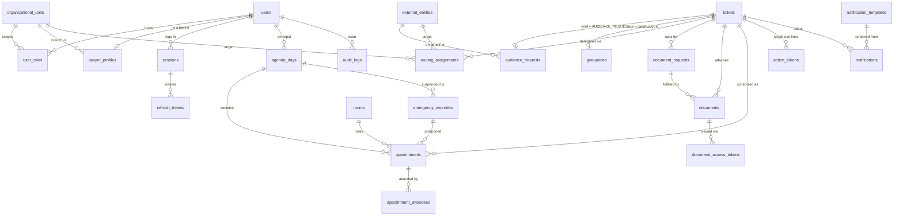
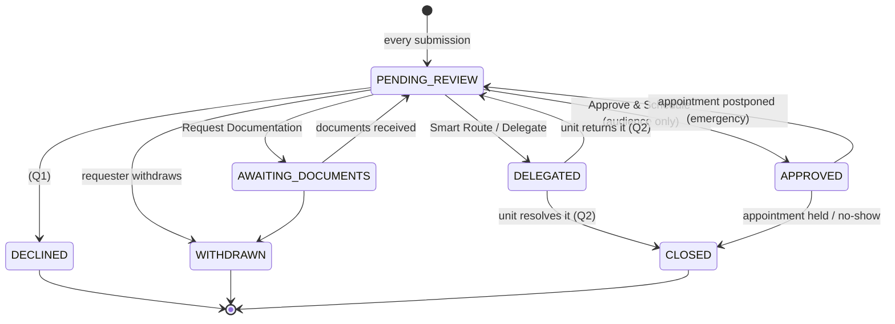

# Database design

> **Status: implemented (Phase 1).** The design below was approved on 2026-10-06
> together with the provisional answers to the open questions (§7; Arabic
> version in [`ar/DECISIONS.md`](ar/DECISIONS.md)).
>
> | Artefact                                     | Location                                                                                  |
> | -------------------------------------------- | ----------------------------------------------------------------------------------------- |
> | Migrations (source of truth)                 | [`packages/db/prisma/migrations/`](../packages/db/prisma/migrations)                      |
> | Prisma schema (client only, mirrors the SQL) | [`packages/db/prisma/schema.prisma`](../packages/db/prisma/schema.prisma)                 |
> | Seed                                         | [`packages/db/src/seed/`](../packages/db/src/seed)                                        |
> | 41 SQL constraint checks                     | [`packages/db/tests/constraints.checks.sql`](../packages/db/tests/constraints.checks.sql) |
> | Unit + integration tests                     | [`packages/db/tests/`](../packages/db/tests)                                              |
>
> CI applies the migrations to an empty PostgreSQL 16, fails on any drift between
> the SQL and the Prisma schema, runs the constraint checks and the integration
> tests, and seeds twice to prove the seed is idempotent.

## 1. Overview



The 18 core tables from the brief are all present. Nine supporting tables were
added, each for a stated reason:

| Added table                                                   | Why it exists                                                               |
| ------------------------------------------------------------- | --------------------------------------------------------------------------- |
| `tickets`                                                     | Common supertype of audience requests and grievances (D1).                  |
| `user_roles`                                                  | Roles are scoped, multiple and historical grants, not a column (D2).        |
| `appointment_attendees`                                       | Who attends; lets the DB stop a registered person being double-booked (D4). |
| `ticket_status_transitions`, `appointment_status_transitions` | The state machines as data, enforced by triggers (D5).                      |
| `refresh_tokens`                                              | Rotating refresh tokens with replay detection (D10).                        |
| `action_tokens`                                               | Single-use public links: reschedule responses, document uploads (D9).       |
| `idempotency_keys`                                            | Idempotent mutating endpoints, atomic with the change (D14).                |
| `audit_chain_head`                                            | One-row anchor that serialises the audit hash chain (D11).                  |

## 2. Enumerations

| Enum                      | Values                                                                                                                                                                                                                                                                                             | Notes                                                                                               |
| ------------------------- | -------------------------------------------------------------------------------------------------------------------------------------------------------------------------------------------------------------------------------------------------------------------------------------------------- | --------------------------------------------------------------------------------------------------- |
| `user_role`               | `SYSTEM_ADMIN`, `AUDITOR`, `GRAND_SYNDIC`, `SECRETARIAT_HEAD`, `SECRETARIAT_OFFICER`, `COUNCIL_MEMBER`, `BRANCH_OFFICER`, `COMMITTEE_MEMBER`, `LAWYER`                                                                                                                                             | MFA mandatory for all except `LAWYER` (optional OTP). `SYSTEM_ADMIN` has no access to case content. |
| `request_status`          | `PENDING_REVIEW`, `AWAITING_DOCUMENTS`, `DELEGATED`, `APPROVED`, `DECLINED`, `WITHDRAWN`, `CLOSED`                                                                                                                                                                                                 | `DECLINED` per decision **Q1** (no reason sent).                                                    |
| `appointment_status`      | `SCHEDULED`, `COMPLETED`, `CANCELLED`, `POSTPONED`, `RESCHEDULED`, `NO_SHOW`, `TRANSFERRED`                                                                                                                                                                                                        | Only `SCHEDULED` occupies time.                                                                     |
| `priority_tier`           | `CRITICAL` (red), `INTERNAL` (blue), `STANDARD` (green)                                                                                                                                                                                                                                            |                                                                                                     |
| `requester_type`          | `CITIZEN`, `LAWYER`, `STATE_INSTITUTION`, `JUDICIAL_AUTHORITY`, `MEDIA`, `DELEGATION`                                                                                                                                                                                                              | Drives the default priority (D15).                                                                  |
| `meeting_mode`            | `IN_PERSON`, `REMOTE`                                                                                                                                                                                                                                                                              |                                                                                                     |
| `routing_target_type`     | `ORGANIZATIONAL_UNIT`, `EXTERNAL_ENTITY`                                                                                                                                                                                                                                                           |                                                                                                     |
| `notification_channel`    | `SMS`, `EMAIL`, `IN_APP`                                                                                                                                                                                                                                                                           |                                                                                                     |
| `notification_status`     | `QUEUED`, `SENDING`, `SENT`, `DELIVERED`, `FAILED`, `CANCELLED`                                                                                                                                                                                                                                    |                                                                                                     |
| `document_classification` | `INTERNAL`, `CONFIDENTIAL`, `RESTRICTED`                                                                                                                                                                                                                                                           | Per decision **Q6**.                                                                                |
| `appointment_origin`      | `SECRETARIAT`, `PRINCIPAL`                                                                                                                                                                                                                                                                         | D18.                                                                                                |
| Supporting                | `user_status`, `lawyer_practice_status`, `governorate` (14), `org_unit_type`, `external_entity_type`, `ticket_kind`, `submission_channel`, `attendee_role`, `grievance_type`, `routing_status`, `document_request_status`, `scan_status`, `action_token_purpose`, `emergency_action`, `job_status` |                                                                                                     |

PostgreSQL enums are used (rather than lookup tables) because every value here
has code behaviour attached to it; adding one is a deliberate migration plus a
code change, which is exactly the friction wanted. Values match `@sba/shared`
constants and API payloads one-to-one.

## 3. Ticket state machine



Grievances follow the same machine **without** the `APPROVED` branch: they are
routed to the competent body, never placed directly on the Grand Syndic's agenda
(a lawyer who wants an audience files an audience request).

Appointments: `SCHEDULED → COMPLETED | CANCELLED | POSTPONED | RESCHEDULED | NO_SHOW`,
`POSTPONED → RESCHEDULED | CANCELLED`. Everything else is terminal.

## 4. Design decisions (cause → effect)

**D1 — Ticket supertype.** _Cause:_ audience requests and grievances share the queue,
the state machine, routing, document requests, documents and the lawyer's "my
tickets" view, but have different fields. _Effect:_ a `tickets` table holds the
shared lifecycle; `audience_requests` and `grievances` are 1:1 detail tables.
Each detail row carries a constant `ticket_kind` column and a composite foreign key
to `tickets (id, kind)`, so the database rejects a grievance detail attached to an
audience ticket, and `appointments` can only reference audience-request tickets.
Child tables (`routing_assignments`, `documents` …) need a single real foreign key
instead of two nullable ones.

**D2 — Roles as grants.** _Cause:_ a person can hold several roles; branch officers
and committee members act only for their unit; who granted what and when is itself
an institutional record. _Effect:_ `user_roles (user_id, role, org_unit_id, granted_by,
granted_at, revoked_at)`. Revocation sets `revoked_at`, never deletes. A partial
unique index allows exactly one active `GRAND_SYNDIC`.

**D3 — Generated time range.** _Cause:_ `EXCLUDE` constraints need a `tstzrange`,
but Prisma cannot read or write range types. _Effect:_ the app writes plain
`starts_at` / `ends_at`; `slot` is a `GENERATED ALWAYS … STORED` column the
application can never set inconsistently. Ranges are half-open `[start, end)`, so
10:00–10:30 and 10:30–11:00 do not conflict.

**D4 — Double booking is impossible at the database level.** _Cause:_ two
Secretariat officers approving at the same instant would both pass an application
check. _Effect:_ three `EXCLUDE USING gist` constraints (via `btree_gist`):
the principal (Grand Syndic) cannot have overlapping `SCHEDULED` appointments,
a room cannot be double-booked, and a registered attendee (e.g. a lawyer) cannot
be in two overlapping meetings. For attendees, the parent's `slot` and "occupies
time" flag are copied by triggers into `appointment_attendees` — the application
cannot set them (a check proves an attempt to spoof them is overridden). The
losing transaction receives SQLSTATE `23P01`, which the API maps to a clear Arabic
conflict message.

**D5 — State machines in the database too.** _Cause:_ the brief demands illegal
transitions be rejected; a service-layer bug or a manual SQL fix must not be able
to skip review. _Effect:_ transition tables + `BEFORE UPDATE` triggers reject
anything not listed; an `INSERT` trigger rejects any ticket not created as
`PENDING_REVIEW` (**no auto-confirmation, ever**). The runtime role cannot modify
the transition tables. The service layer keeps its own copy of the machine
(`@sba/shared`) for clear errors; a Phase 5 test asserts both copies are identical.

**D6 — Agenda days.** _Cause:_ the Grand Syndic thinks in days, emergency
reschedules act on "the rest of today", and "today" means Damascus, not UTC.
_Effect:_ `agenda_days (principal, agenda_date)` with `agenda_date` a local date.
A trigger rejects an appointment whose start or end falls outside that date in
`Asia/Damascus`, whose principal differs from the day's owner, or that is booked
onto a suspended day. The schema supports any principal, not only the Grand
Syndic (**Q14**).

**D7 — Emergency override frees time without deleting history.** _Cause:_
postponed meetings must stay on record, yet their slots must become bookable.
_Effect:_ `EXCLUDE` constraints apply only `WHERE status = 'SCHEDULED'`; moving an
appointment to `POSTPONED` releases the Syndic, the room and every attendee in
one update. `emergency_overrides` records who triggered it, from what time,
the background job id and status, and how many appointments were affected; each
postponed appointment references its override.

**D8 — Envelope encryption metadata.** _Cause:_ AES-256-GCM at rest, keys outside
the database, rotation without re-encrypting files. _Effect:_ per document:
`kek_id` (which master key), `wrapped_dek` (60 bytes: nonce‖wrapped key‖tag),
`content_iv` (12 bytes), `content_auth_tag` (16 bytes), and `metadata_enc` (the
original file name, which can itself be sensitive, encrypted under the same DEK
with its own nonce). Rotation re-wraps DEKs only. `ciphertext_sha256` checks
storage integrity before decryption; `plaintext_sha256` supports chain-of-custody
("this is the exact document submitted"), at the accepted cost that someone who
already holds a candidate file could confirm it matches. Storage keys are random
and meaningless. A `CHECK` allows only PDF/JPEG/PNG (**Q13**); a document cannot be
viewed until `scan_status = 'CLEAN'`.

**D9 — Tokens are stored hashed.** _Cause:_ a database leak must not yield usable
links. _Effect:_ only SHA-256 hashes of tokens are stored. Document view tokens
are bound to a user _and_ a session, default to 5 minutes and are capped at 15 by
a `CHECK`; every access increments a counter and writes an audit entry. Public
action tokens (reschedule response, document upload) are single-use, consumed by
one atomic `UPDATE … WHERE consumed_at IS NULL AND expires_at > now() RETURNING`.

**D10 — Identity data.** _Cause:_ lawyers log in with registration number +
national ID + password, but national IDs should not sit in plaintext. _Effect:_
`national_id_hmac` (HMAC-SHA256 with a secret pepper from a file) for login
matching, plus `national_id_enc` for authorised display. Password hashes must be
Argon2id (`CHECK`). TOTP secrets are stored encrypted. Sessions are server-side
rows; each refresh token is a row, and presenting an already-rotated token revokes
the whole session (replay detection).

**D11 — Immutable, tamper-evident audit log.** _Cause:_ "who did what, when" must
stand up to scrutiny, including scrutiny of the system's own operators.
_Effect:_

- Append-only: triggers reject `UPDATE`, `DELETE` and `TRUNCATE` (even by the owner),
  and the runtime role has no such privileges anyway.
- Hash chain: each row stores `prev_hash` and `row_hash = sha256(prev_hash ‖ canonical row)`.
  A `SECURITY DEFINER` trigger takes a row lock on the single `audit_chain_head` row,
  so concurrent writers are serialised (under `REPEATABLE READ` they fail and retry
  rather than fork the chain). The runtime role has no privilege on the head.
- `audit_verify_chain()` returns the first broken row; the checks prove that a
  superuser disabling triggers and editing a row is detected.
- A database superuser can still rewrite the whole chain. **Recommendation:** a daily
  job publishes the current head hash outside the database (e.g. printed in the
  Secretariat's paper register or sent to a separate archive host), making silent
  rewrites detectable.
- `audit_logs.session_id` has no foreign key on purpose: audit history must not
  depend on session rows that may be purged.

**D12 — Soft deletion only where it is legally meaningful.** _Cause:_ these are
legal records. _Effect:_ the runtime role has no `DELETE` on tickets, detail tables,
appointments, attendees, documents, routing, document requests, notifications, users,
lawyer profiles, roles or emergency overrides. Tickets end via statuses
(`DECLINED`, `WITHDRAWN`, `CLOSED`); users via `status = DISABLED`; roles via
`revoked_at`; reference data via `is_active`; documents via `deleted_at` +
`deleted_by_user_id` (both or neither). Audit logs are never deleted. Expired
tokens, sessions and idempotency keys are purgeable housekeeping data. Retention
periods: **Q7**.

**D13 — Notifications as a transactional outbox.** _Cause:_ an approval must never
commit without its notification, nor a notification go out for a rolled-back
approval. _Effect:_ the `notifications` row is inserted in the same transaction;
a dispatcher hands it to BullMQ; workers retry with backoff (`attempts`,
`next_attempt_at`) and store `rendered_body` — exactly what was sent. Templates are
versioned and immutable once used (new wording = new version, one active version
per code/channel), so any message can be traced to the wording approved at the time.
Arabic template text is seeded from `locales/ar.json` so there is one source of truth.

**D14 — Idempotency in PostgreSQL, not Redis.** _Cause:_ a retried "approve" must
not create a second appointment, and the idempotency record must commit or roll
back with the action itself. _Effect:_ `idempotency_keys (scope, user_id, key)`
unique (`NULLS NOT DISTINCT` so anonymous public submissions are covered), with the
request hash (a reused key with a different body is rejected) and stored response.

**D15 — Priority is derived, then owned by a human.** _Cause:_ the colour queues
depend on who is asking, but the Secretariat must be able to correct it.
_Effect:_ on intake the priority is derived from `requester_type` (state
institution / judicial authority → `CRITICAL`, lawyer → `INTERNAL`, everything else
→ `STANDARD`; an `external_entities.default_priority` overrides). Secretariat
changes are ordinary audited updates.

**D16 — Least-privilege runtime role.** _Cause:_ the API process is the most exposed
component. _Effect:_ migrations run as the owner; the API connects as `sba_app`
with DML only and the revocations above. Even a fully compromised API cannot
rewrite audit history, widen the state machines or hard-delete records.

**D17 — Keys and identifiers.** UUID v4 primary keys (`gen_random_uuid()`, built in)
so identifiers are not guessable or countable from outside; human-facing
`reference_code` is a separate unique column. `audit_logs` uses a `bigint` identity
because the chain needs a strict order. All timestamps are `timestamptz`; every
mutable table has `created_at` / `updated_at` (maintained by trigger as well as by
Prisma, so raw SQL fixes stay correct).

**D18 — Appointments are independent of requests (added 2026-10-07).** _Cause:_ the
Grand Syndic needs to put his own engagements on his agenda so the Secretariat
never books over them. _Effect:_ `appointments.ticket_id` is nullable and a new
`origin` column (`SECRETARIAT` | `PRINCIPAL`) says who created the entry. A `CHECK`
requires a request for Secretariat bookings and forbids one (but requires a
`title`) for the principal's own entries. Own entries occupy time like any other,
so the existing `EXCLUDE` constraint rejects any Secretariat booking over them.
`is_private` (principal entries only) means the Secretariat sees "reserved"
without details; `location_note` holds a free-text place for entries outside the
Bar's rooms.

**D19 — Transfer to a council member (added 2026-10-07).** _Cause:_ the Grand Syndic
may hand an audience to another member of the Bar Council so the visitor is
received by that member instead. _Effect:_ new role `COUNCIL_MEMBER` (members can
own an agenda) and appointment status `TRANSFERRED` (`SCHEDULED → TRANSFERRED`). The
original row becomes `TRANSFERRED`, releasing the Grand Syndic's time; a new row on
the member's agenda points back through `transferred_from_id` (with
`transfer_note`). The visitor is notified with the `APPOINTMENT_TRANSFERRED`
template. Same time and place by default.

**D20 — Live tracking (added 2026-10-07).** _Cause:_ a live "in the office now /
waiting / next" board. _Effect:_ `arrived_at`, `started_at`, `ended_at` recorded by
the Secretariat, ordered by a `CHECK`. The status stays `SCHEDULED` until
`COMPLETED`, so double-booking protection is untouched.

**D21 — Transfer timing (approved 2026-10-07).** _Cause:_ the owner decided that a
transferred audience either keeps its time or gets a new one set by the member or
the Secretariat. _Effect:_ the original row records `transferred_to_user_id` (present
if and only if the status is `TRANSFERRED`). With "same time", the continuation row
on the member's agenda is created at once; with "new time", none exists until the
member or the Secretariat schedules it. A trigger ensures a continuation sits on the
chosen member's agenda and keeps the same audience request; a partial unique index
allows one continuation per transfer. The visitor receives
`APPOINTMENT_TRANSFERRED` (same time) or `APPOINTMENT_TRANSFERRED_NEW_TIME`, then the
usual confirmation once the new time is set.

## 5. Indexing summary

| Purpose             | Index                                                                                             |
| ------------------- | ------------------------------------------------------------------------------------------------- |
| Secretariat board   | `tickets (priority, submitted_at) WHERE status IN ('PENDING_REVIEW','AWAITING_DOCUMENTS')`        |
| Lawyer "my tickets" | `tickets (submitted_by_user_id, submitted_at DESC)`                                               |
| Syndic daily agenda | `appointments (agenda_day_id, starts_at)` + `agenda_days (principal_user_id, agenda_date)` unique |
| Conflict detection  | GiST indexes behind the three `EXCLUDE` constraints                                               |
| Unit inboxes        | `routing_assignments (target_org_unit_id, status)`, `(target_external_entity_id, status)`         |
| One open item       | partial unique: one live appointment per ticket, one open routing, one open document request      |
| Outbox dispatch     | `notifications (next_attempt_at) WHERE status IN ('QUEUED','FAILED')`                             |
| Key rotation sweep  | `documents (kek_id)`                                                                              |
| Audit lookups       | `audit_logs (entity_type, entity_id, id)`, `(actor_user_id, occurred_at)`                         |

## 6. Implementation notes

### SQL first, Prisma second

The migrations are hand-written SQL because Prisma's schema language cannot express:

- `CREATE EXTENSION btree_gist, citext`
- `EXCLUDE` constraints, `CHECK` constraints, `NULLS NOT DISTINCT` uniques
- The generated `slot` columns (declared `Unsupported("tstzrange")` in Prisma, never written)
- Composite `(id, kind)` subtype foreign keys
- All triggers and functions (lifecycle, attendee slot sync, audit chain, `updated_at`)
- Transition-table contents (structural data, so they live in migrations, not the seed)
- Role creation and `GRANT` / `REVOKE`

`schema.prisma` was produced by introspecting the migrated database and then
renamed to the project's conventions (PascalCase models, camelCase fields with
`@map`). CI runs `prisma migrate diff --from-config-datasource --to-schema … --exit-code`
after migrating, so the two cannot drift.

**To change the schema:** add a new SQL migration under `prisma/migrations/`,
apply it locally, then edit `schema.prisma` until `pnpm --filter @sba/db drift`
reports no difference. A new table that holds legal records must also
`REVOKE DELETE … FROM sba_app` (default privileges grant DML automatically).

Two schema adjustments were needed for Prisma and are documented in the SQL:

- `audience_requests` and `grievances` carry a `UNIQUE (ticket_id, ticket_kind)`
  that is redundant with their primary key; Prisma needs it to model the 1:1
  subtype relation over the composite foreign key.
- The back-relations from tickets to appointments, routing assignments and
  document requests, and from sessions to refresh tokens, are declared
  one-to-many even though introspection inferred one-to-one (see next point).

### Partial unique indexes — a Prisma pitfall

Prisma's `partialIndexes` feature treats a partial unique index such as
`UNIQUE (ticket_id) WHERE status = 'SCHEDULED'` as if the column were unique
everywhere, and offers it in `findUnique`, `upsert` and `connect`. Those calls
would also match historical rows. Every such field is marked
`PARTIAL UNIQUE` in `schema.prisma` (the note appears in the generated types).
**Rule:** query them with `findFirst` plus the index predicate. Affected:
`Appointment.ticketId`, `DocumentRequest.ticketId`, `RoutingAssignment.ticketId`,
`RefreshToken.sessionId`, `UserRoleGrant.role`, `OrganizationalUnit.governorate`,
and the compound uniques on `NotificationTemplate` and `UserRoleGrant`.

### Roles and connections

| Connection               | Role                          | Used by                            |
| ------------------------ | ----------------------------- | ---------------------------------- |
| `DATABASE_MIGRATION_URL` | schema owner                  | `prisma migrate deploy`, the seed  |
| `DATABASE_URL`           | `sba_app` (DML only, see D16) | the API and workers (from Phase 2) |

In Docker, `infra/postgres/init/02-roles.sh` creates `sba_app` with
`POSTGRES_APP_PASSWORD`; the `runtime_role` migration grants its privileges.
Elsewhere the migration creates it `NOLOGIN` and operations must set a password.

### Seed

`pnpm db:seed` (idempotent, one transaction, writes a `system.seed` audit entry):

- The Grand Syndic office, the Central Secretariat, the central Disciplinary
  Committee (decision Q10), and the 14 branch councils named «مجلس فرع …» (Q15).
- The Ministry of Justice and the Supreme Judicial Council as external entities
  with `CRITICAL` default priority.
- 16 Arabic notification templates (8 codes × SMS / e-mail), copied from
  `locales/ar.json`. Changed wording becomes a new version; the old one is retired.
- Only when `SEED_DEMO_DATA=true` (refused in production): one demo user per staff
  role, two demo lawyers (practising and trainee) with HMAC + encrypted national
  IDs, and one demo room. Demo addresses use the reserved `.invalid` domain.

Reference rows are created when missing and never overwritten, because staff may
have edited them since.

### Commands

```sh
pnpm secrets:dev     # create dev key material in infra/secrets/ (never overwrites)
pnpm db:migrate      # apply migrations (DATABASE_MIGRATION_URL)
pnpm db:seed         # build and run the seed
pnpm db:test         # integration tests against a migrated, empty database
psql -v ON_ERROR_STOP=1 -f packages/db/tests/constraints.checks.sql   # rolled back afterwards
```

## 7. Decisions (approved 2026-10-06)

The project owner approved the provisional answers below. They are institutional
choices and can be revisited; each is referenced where it shapes the schema.

| #   | Question                                                                                                                                                                                               | Adopted decision                                                                                                      |
| --- | ------------------------------------------------------------------------------------------------------------------------------------------------------------------------------------------------------ | --------------------------------------------------------------------------------------------------------------------- |
| Q1  | May the Secretariat **decline** a request (a fourth action besides approve / delegate / request documents)? If so, is a reason communicated to the requester?                                          | `DECLINED` status exists; no reason is sent.                                                                          |
| Q2  | After **delegation** to a branch or committee, does the unit close the matter itself, or report back to the Secretariat? May it return the matter?                                                     | Unit can close it (`CLOSED`) or return it (`PENDING_REVIEW`).                                                         |
| Q3  | Do **grievances** always pass through the central Secretariat first, or go directly to the respondent's branch / disciplinary council? Which body handles complaints about judicial matters in courts? | All pass through the Secretariat queue, then are delegated.                                                           |
| Q4  | Which **lawyer categories** exist in the register (e.g. practising, trainee/متمرن, suspended, non-practising), and which may log in, file grievances or request an audience?                           | Four statuses; permissions decided in Phase 2.                                                                        |
| Q5  | How are **lawyer accounts** created: import from the Bar's existing register (is there a system to integrate with?) or self-registration verified by the branch?                                       | Not modelled yet beyond `lawyer_profiles`.                                                                            |
| Q6  | What **document classification levels** does the Bar use?                                                                                                                                              | `INTERNAL`, `CONFIDENTIAL`, `RESTRICTED`.                                                                             |
| Q7  | **Retention periods** for tickets, documents, notifications and audit logs? May documents ever be purged?                                                                                              | Nothing is purged except expired tokens/sessions.                                                                     |
| Q8  | What may an attendee do with the **reschedule link** after an emergency?                                                                                                                               | Acknowledge and optionally state a preference; the request returns to the Secretariat queue. No slots are ever shown. |
| Q9  | Who may trigger an **emergency reschedule** — only the Grand Syndic, or also the Secretariat Head on his behalf? Are both "cancel" and "postpone" needed?                                              | Both actions modelled; initiator is any authorised user, recorded.                                                    |
| Q10 | Which **committees** should be seeded, centrally and per branch (e.g. branch disciplinary councils)?                                                                                                   | Only the central Disciplinary Committee.                                                                              |
| Q11 | Will **Ministry of Justice / SJC liaison officers** have accounts, or always submit through the public form or via the Secretariat?                                                                    | No external accounts; requests carry an `external_entity_id`.                                                         |
| Q12 | Must free-text fields (request purpose, grievance description) be **field-level encrypted**? Cost: no database search on them.                                                                         | Not field-encrypted; protected by RBAC, disk encryption and backups encryption.                                       |
| Q13 | Accepted **file types and maximum size**? Are Word documents needed?                                                                                                                                   | PDF, JPEG, PNG; size limit set in Phase 3.                                                                            |
| Q14 | Does any official **other than the Grand Syndic** need an agenda in this system (e.g. deputy, Secretary of the Bar)?                                                                                   | Schema supports any principal; UI only for the Grand Syndic.                                                          |
| Q15 | Official naming of branch councils, e.g. «مجلس فرع دمشق» vs «فرع نقابة المحامين بدمشق»?                                                                                                                | «مجلس فرع {المحافظة}».                                                                                                |
| Q16 | **Numerals** in the UI and SMS: Eastern Arabic (٠١٢٣) or Western (0123)?                                                                                                                               | Locale default for `ar-SY` (Eastern Arabic).                                                                          |
